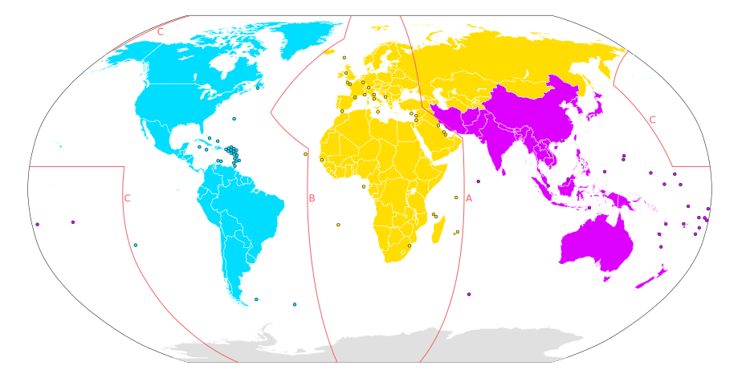

# LoRa Excel Data Streamer
Using LoRa radios from XinaBox to send data to Excel Data Streamer

## Getting Started

### Get the components

Go to https://xinabox.cc and get yourself the following xChips:

Qty|xChip|Description
---|:---:|---
2|CR0x|Arduino Uno core xChip with LoRa radio
1 | IP01 | Power, Programming and Comminucation xChip
1| PG01| Generic Power xChip, 6-24 Volt DC input
1 | SW01 | Weather Sensors for Temperature, Humidity and Bariometric Pressure
1 | OC03 | Relay
1|XC10|bag of connectors

#### Notes on the xChips

Study this map for which ITU Region you belong to:

xChip|ITU Regions|Frequency|Notes
---|:---:|---:|---
CR01|-|433.25 MHz|Can be used globally if you hold a Radio Amateur License
CR02|1 (Yellow/B)|868.00 MHz|
CR03|2 (Blue/C)|915.00 MHz|

